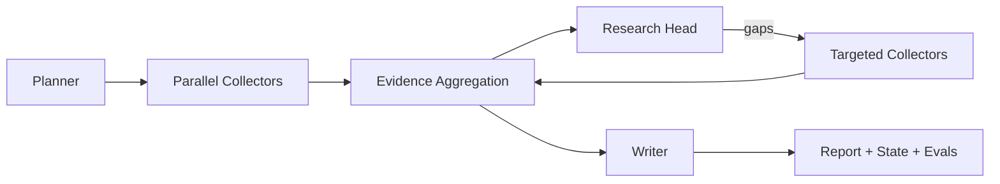

# Architecture Diagram

```mermaid
flowchart LR
    A[Planner] --> B[Parallel Collectors]
    B --> C[Evidence Aggregation]
    C --> D[Research Head]
    D -->|gaps| E[Targeted Collectors]
    E --> C
    C --> F[Writer]
    F --> G[Report + State + Evals]
```
