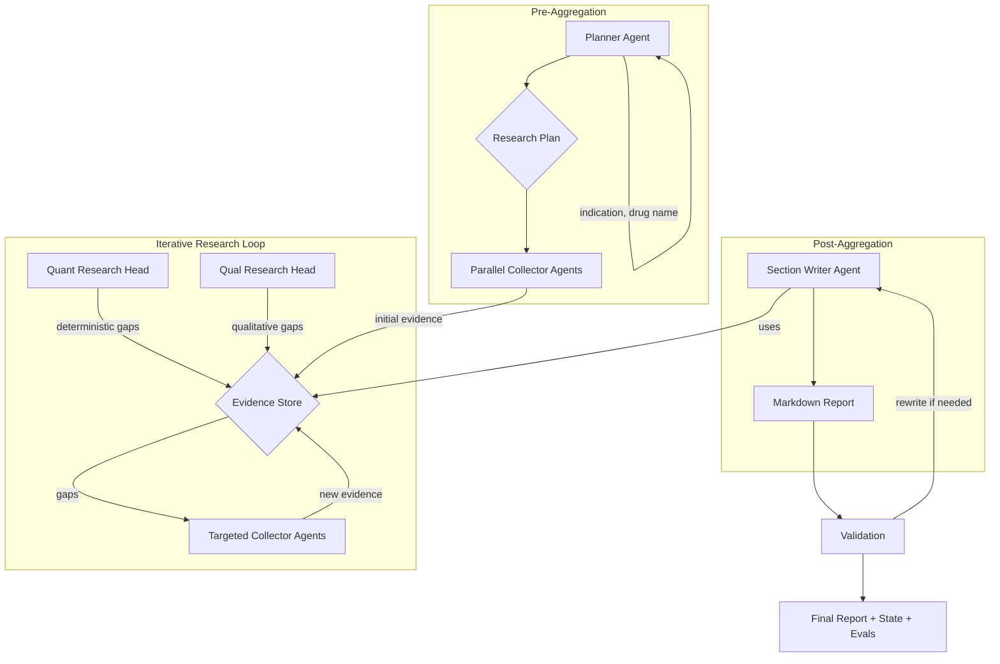

```mermaid
graph TD
    subgraph "Pre-Aggregation"
        A[Planner Agent] --> B{Research Plan};
        B --> C[Parallel Collector Agents];
    end

    subgraph "Iterative Research Loop"
        D1[Quant Research Head] -- deterministic gaps --> E{Evidence Store};
        D2[Qual Research Head] -- qualitative gaps --> E;
        E -- gaps --> F[Targeted Collector Agents];
        F -- new evidence --> E;
    end

    subgraph "Post-Aggregation"
        G[Section Writer Agent] -- uses --> E;
        G --> H[Markdown Report];
    end

    C -- initial evidence --> E;
    A -- indication, drug name --> A;
    H --> I[Validation];
    I -- rewrite if needed --> G;
    I --> J[Final Report + State + Evals];
```
