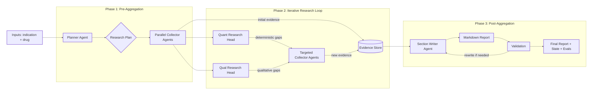

```mermaid
%%{init: {"themeVariables": {"fontSize": "24px"}, "flowchart": {"nodeSpacing": 140, "rankSpacing": 100, "diagramPadding": 50}} }%%
flowchart LR
    U[Inputs: indication + drug]

    subgraph P1[Phase 1: Pre-Aggregation]
        A[Planner Agent] --> B{Research Plan}
        B --> C[Parallel Collector Agents]
    end

    subgraph P2[Phase 2: Iterative Research Loop]
        E[(Evidence Store)]
        D1[Quant Research Head]
        D2[Qual Research Head]
        F[Targeted Collector Agents]
        C -- initial evidence --> E
        C --> D1
        C --> D2
        D1 -- deterministic gaps --> F
        D2 -- qualitative gaps --> F
        F -- new evidence --> E
    end

    subgraph P3[Phase 3: Post-Aggregation]
        G[Section Writer Agent] --> H[Markdown Report]
        H --> I[Validation]
        I -- rewrite if needed --> G
        I --> J[Final Report + State + Evals]
    end

    U --> A
    E --> G

    classDef big font-size:24px,stroke-width:3px;
    class U,A,B,C,D1,D2,E,F,G,H,I,J big;
```
